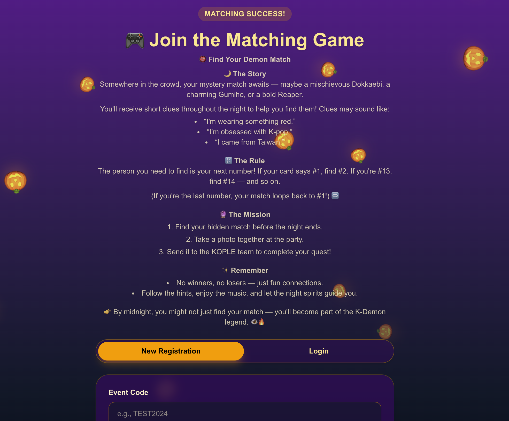
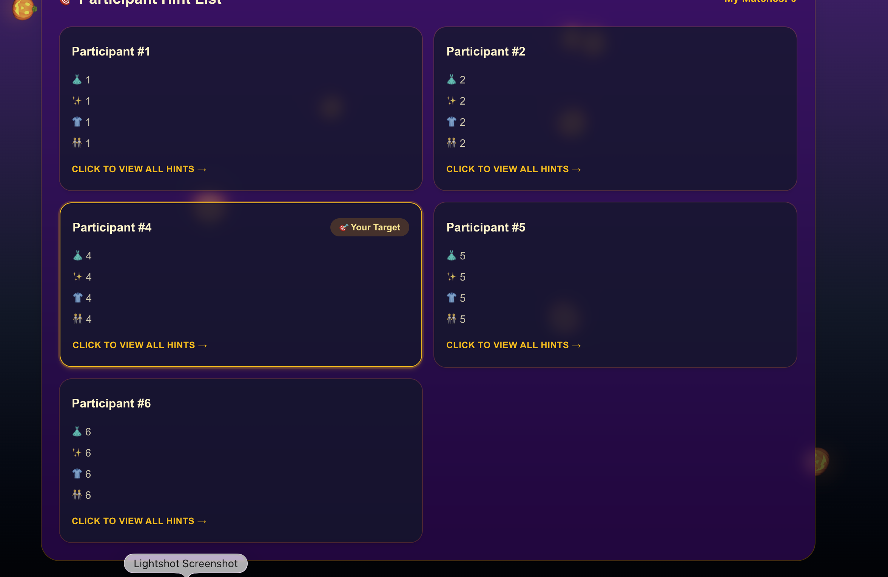

# Kople Game — 실시간 힌트 기반 매칭 게임

참가자들이 힌트를 제출하고, 서로의 정체를 추리하며 자연스럽게 대화를 시작할 수 있도록 돕는 실시간 소셜 매칭 플랫폼입니다.


---

## 스크린샷

| 홈 화면 | 이벤트 화면 |
|:---:|:---:|
|  |  |

## 프로젝트 소개

**Kople Game**은 대한민국 최대 외국인 커뮤니티 [코플(Kople)](https://www.thekople.com/)의 오프라인 모임에서 어색한 분위기를 깨고 자연스러운 대화를 유도하기 위해 제작한 실시간 매칭 웹앱입니다.

각 참가자는 자신을 설명하는 4가지 힌트를 제출하고, 다른 참가자의 힌트를 보며 해당 인물이 누구인지 추리합니다. 정답을 맞히면 매칭이 완료되며, 이 과정에서 참가자들이 서로에게 먼저 말을 걸 수 있는 계기를 만들어 줍니다.

- 이벤트 코드 하나로 게임 방을 즉시 생성하여 **진입 장벽 최소화**
- Firestore 실시간 동기화로 **별도 새로고침 없이 즉시 반영**
- PWA 지원으로 **앱 설치 없이 모바일에서 바로 사용 가능**

## 주요 기능

- **힌트 기반 매칭 시스템** — 4개의 힌트를 제출하고 다른 참가자의 힌트를 보며 추리
- **실시간 동기화** — Firebase Firestore 기반으로 참가자 정보가 즉시 업데이트
- **이벤트 코드 시스템** — 코드 하나로 간편하게 이벤트별 게임 방 생성
- **PWA 지원** — Service Worker와 Web Manifest로 앱처럼 설치 가능
- **닉네임 캐싱** — 로컬 스토리지 기반으로 재접속 시 자동 닉네임 복구
- **개인정보 보호** — 전화번호/이메일 입력 방지 유효성 검사, 익명 인증

## 기술 스택

| 분류 | 기술 |
|------|------|
| Framework | Next.js 15 (App Router) |
| UI | React 19, Tailwind CSS 4 |
| Language | TypeScript 5 |
| Backend | Firebase Firestore, Firebase Authentication |
| Deployment | Vercel |
| PWA | Service Worker, Web Manifest |

## 아키텍처

```
Client (Next.js + React)
    │
    ├── Firebase Auth ─── 익명 인증
    │
    └── Firestore ─── 실시간 동기화 (onSnapshot)
            │
            ├── events/{code}          # 이벤트 메타 정보
            └── events/{code}/players  # 참가자 힌트 및 매칭 상태
```

## 프로젝트 구조

```
src/
├── app/
│   ├── layout.tsx                  # 루트 레이아웃
│   ├── page.tsx                    # 홈페이지 (이벤트 코드 입력)
│   ├── globals.css                 # 글로벌 스타일
│   └── event/[code]/
│       └── page.tsx                # 이벤트별 게임 화면
├── components/
│   └── FallingPumpkins.tsx         # 시즌 이벤트 컴포넌트
├── lib/
│   └── firebase/
│       ├── config.ts               # Firebase 설정
│       ├── auth.ts                 # 인증 헬퍼
│       └── analytics.ts            # 애널리틱스
└── types/
    └── index.ts                    # TypeScript 타입 정의
```

## 실행 방법

```bash
# 의존성 설치
npm install

# 개발 서버 실행
npm run dev
```

`.env.local` 파일에 Firebase 설정이 필요합니다. [QUICK_START.md](QUICK_START.md)를 참고하세요.

## 라이선스

ISC
